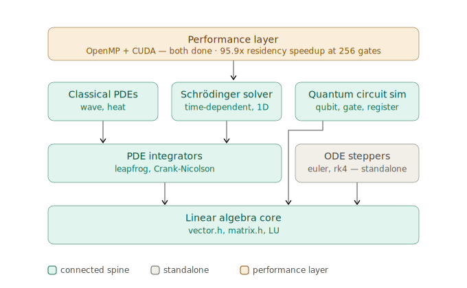

# quantum-sim

A from-scratch numerical simulation engine in C++ — built bottom-up from a templated linear-algebra core, through ODE and PDE integrators, up to a quantum circuit simulator, and finished with an OpenMP + CUDA performance layer. No external numerics libraries: every solver, every gate, and every kernel is written and validated here.

The project is a **layered library, not a pipeline**. One shared substrate (`vector.h`, `matrix.h`) carries three tiers of increasingly specialized physics, and a performance layer accelerates the compute-bound kernels across all of them. The narrative spine is a single arc read three ways:

- **ODE → PDE → quantum** — from ordinary differential equations up to the Schrödinger equation and quantum circuits
- **explicit → implicit** — from explicit steppers whose failure on stiff problems *motivates* implicit Crank-Nicolson
- **serial → parallel → GPU** — from single-threaded baselines to OpenMP to a resident CUDA backend

---

## Headline result: GPU state residency, 95.9× at 256 gates

The strongest technical story in the project is a single benchmark. A naive GPU port of a quantum gate is **transfer-bound**: applying one gate to an `n=20` state (~1M amplitudes, ~16 MB) copies the entire state up to the device and back across PCIe, and that round-trip dwarfs the sub-millisecond kernel. The naive approach pays this cost *on every gate*, so its runtime scales linearly with circuit depth.

The fix is **residency**: upload the state once, run all N gates on the device without touching the host, download once. Transfer cost goes from O(N) to constant.

Measured on a Colab **T4 (sm_75)**, `n=20` qubits, Hadamard swept across targets:

| gates | per-gate (ms) | resident (ms) | speedup |
|------:|--------------:|--------------:|--------:|
|     1 |        53.827 |        53.658 |   1.00× |
|     2 |        94.389 |        51.797 |   1.82× |
|     4 |       185.855 |        56.360 |   3.30× |
|     8 |       398.019 |        64.245 |   6.20× |
|    16 |       746.408 |        52.418 |  14.24× |
|    32 |      1511.318 |        58.072 |  26.02× |
|    64 |      3679.334 |        68.852 |  53.44× |
|   128 |      6206.387 |        98.171 |  63.22× |
|   256 |     12834.275 |       133.783 | **95.93×** |

**Reading the table:** per-gate time roughly doubles as the gate count doubles — every gate pays the full PCIe round-trip, so cost is linear in depth. Resident time stays nearly flat: one upload, one download, amortized across the whole circuit. The crossover is at **N=2** (residency wins from the second gate onward). At the tail, resident time drifts upward (68 → 98 → 133 ms) — the transfer tax is gone, so accumulating kernel-launch overhead becomes the next bottleneck. Every feature of the curve is explainable from the roofline model.

Correctness was pinned down *before* the benchmark ran: a parity oracle compares the CPU and CUDA gate paths amplitude-by-amplitude and reports **max difference = 0.000e+00** at 12 qubits / 4096 amplitudes. The two paths do identical arithmetic in identical order on identical doubles, so the result is bit-exact rather than merely within tolerance. (See [DESIGN.md](DESIGN.md) for why exact zero is the *expected* outcome here, and the one compiler assumption that would break it.)

---

## Architecture



Four tiers, bottom-up:

- **Linear algebra core** — `vector.h`, `matrix.h` with LU decomposition. Templated primitives; everything else is built on these.
- **Numerical methods** — ODE steppers (`euler`, `rk4`) and PDE integrators (leapfrog, Crank-Nicolson). The ODE steppers are *standalone*: they establish the accuracy baseline that motivates the implicit methods, but nothing in the PDE/quantum stack calls them directly.
- **Applications** — classical PDEs (wave, heat), the Schrödinger solver, and the quantum circuit simulator (`qubit`, `quantum_gate`, `quantum_register`). Classical PDEs and the Schrödinger solver both depend on the PDE integrators; the circuit simulator depends **directly on the linear algebra core**, bypassing the PDE layer entirely, because gate application is matrix/vector work with no stepper involved.
- **Performance layer** — OpenMP and CUDA over the compute-bound kernels.

---

## What's inside, layer by layer

### Linear algebra core
Templated `Vector` and `Matrix` with an LU decomposition used by the implicit PDE solver. The core is deliberately small and shared — the same `Matrix<Complex>` that represents a quantum gate also represents a Crank-Nicolson update operator.

### ODE steppers — the accuracy baseline
Explicit Euler and RK4, validated against a problem with a known analytic solution. RK4's fourth-order accuracy is visible directly: at a matched step size (dt = 0.01 on dy/dt = −y at t = 1), RK4's error was **3.09e-11** against Euler's **1.8e-3** — the O(Δt⁴) vs O(Δt) gap that theory predicts. This is the baseline whose breakdown on stiff and PDE problems justifies moving to implicit methods — RK4 is a reference point, not a load-bearing dependency of the solvers above it.

### PDE integrators — explicit to implicit
The classical wave and heat equations are solved and validated physically (energy behavior, diffusion profiles) with a Catch2 test suite. The Schrödinger solver uses **Crank-Nicolson**, chosen because the implicit update is unconditionally stable and, critically, **unitary**: the update operator preserves the L2 norm of the wavefunction exactly, so probability is conserved by construction rather than by luck. The amplification factor satisfies |g| = 1 for all modes — the property an explicit scheme cannot guarantee on this problem. The LU factorization of the update operator is computed **once** and reused across time steps, since the operator is constant in time.

### Quantum circuit simulator
State-vector simulation built on the linear algebra core: `qubit`, `quantum_gate`, and `quantum_register` classes with gate application, measurement (Born rule), and multi-qubit registers. Validated on two canonical protocols:

- **Bell state** — entanglement produces perfectly correlated measurement outcomes: **1000/1000** trials correlated.
- **Quantum teleportation** — the full protocol with all four correction branches exercised: **1000/1000** successful across every branch.

### Performance layer — three regimes of the roofline
The performance work is organized around the roofline model, with a deliberately chosen example of each regime:

- **Compute-bound** — the gate sweep. OpenMP gives a **3.2×** speedup; this kernel does enough arithmetic per memory access to scale with cores.
- **Intermediate** — the Born-rule probability reduction, **2.5×** with OpenMP.
- **Memory-bound** — the heat-equation stencil, kept as the honest contrast case: OpenMP makes it **slower** (<1×), because the stencil is bandwidth-limited and extra threads only add contention.
- **Transfer-bound** — the naive GPU gate. The kernel itself runs in ~0.339 ms, but the host↔device round-trip is ~8.09 ms; transfer is roughly **23× the compute** and about **96%** of wall-clock. A single gate touches the whole ~16 MB state, so copying it dominates. This is the regime the residency optimization above was built to escape.

---

## Build & run

Full instructions — including the Colab GPU workflow and a file-corruption gotcha worth reading before you build — are in [SETUP.md](SETUP.md). The short version:

```bash
# On a Colab T4 runtime (sm_75), with quantum_register.h, matrix.h, vector.h
# and the .cu under test in the same directory:
nvcc -arch=sm_75 -Xcompiler -fopenmp benchmark_residency.cu -o bench && ./bench
```

The `-Xcompiler -fopenmp` forwards the OpenMP flag to the host compiler underneath `nvcc` — the header carries OpenMP pragmas alongside the CUDA.

---

## Repository layout

```
quantum-sim/
├── README.md
├── SETUP.md
├── DESIGN.md
├── .gitignore
│
├── docs/
│   └── quantum_sim_layered_architecture.svg
│
├── include/                    header-only core — templated impls live in the headers (no src/)
│   ├── vector.h                Vector<T> — dot, norm, normalize
│   ├── matrix.h                Matrix<T> — LU decomposition, solve()
│   ├── solver.h                abstract Solver<T> base + ODEFunction typedef
│   ├── euler_solver.h          EulerSolver<T>
│   ├── rk4_solver.h            RK4Solver<T>
│   ├── wave_equation.h         classical wave PDE (leapfrog)
│   ├── heat_equation.h         classical heat PDE (explicit stencil)
│   ├── schrodinger.h           Schrödinger solver (Crank-Nicolson)
│   ├── qubit.h                 Qubit — 2-element complex state, gate + measure
│   ├── quantum_gate.h          2×2 unitary gates
│   ├── quantum_register.h      QuantumRegister — n-qubit state + CUDA backend
│   └── quantum_circuit.h       (empty placeholder — superseded by quantum_register.h)
│
├── cuda/
│   ├── gate.cu                 standalone CUDA gate kernel (smoke test)
│   ├── benchmark.cu            naive per-gate GPU round-trip (transfer-bound baseline)
│   ├── parity_test.cu          CPU-vs-CUDA amplitude parity oracle
│   └── benchmark_residency.cu  per-gate vs resident timing (the 95.9× table)
│
└── tests/                      Catch2 suites (single-header vendored in lib/)
    ├── lib/
    │   └── catch.hpp
    ├── test_vector.cpp
    ├── test_matrix.cpp
    ├── test_complex.cpp        Matrix / Vector over complex<double>
    ├── test_linalg.cpp
    ├── test_solve.cpp          LU solve on identity + 2×2 + 3×3 systems
    ├── test_stress.cpp         200×200 matmul timing benchmark
    ├── test_euler.cpp
    ├── test_rk4.cpp
    ├── test_oscillator.cpp     damped harmonic oscillator
    ├── test_wave.cpp
    ├── test_heat.cpp
    ├── test_schrodinger.cpp
    ├── test_qubit.cpp
    ├── test_register.cpp
    ├── bench_register.cpp      register benchmark harness
    ├── plot_wave.py            renders wave_snapshots.png
    ├── plot_heat.py            renders heat_snapshots.png
    └── plot_schrodinger.py     renders schrodinger_evolution.png
```

The repo root also carries the committed solver outputs kept as proof-of-work — `wave.csv`, `wave_snapshots.png`, `heat_snapshots.png`, `schrodinger_output.csv`, `schrodinger_evolution.png`, and `oscillator.csv`. Compiled test binaries (`test_heat`, `test_register`, `bench_register`, etc.) are gitignored and don't appear in a clone.

CUDA methods are guarded by `#ifdef __CUDACC__` so the header compiles cleanly on a non-NVIDIA machine (g++ / IntelliSense skip the device code). All CUDA runs are on a rented Colab T4 — there is no local NVIDIA GPU in the loop.

---

## Deeper reading

- **[SETUP.md](SETUP.md)** — build, run, and the Colab workflow in full.
- **[DESIGN.md](DESIGN.md)** — the design and physics decisions: why Crank-Nicolson over an explicit scheme, the two-boundary CUDA adapter (layout *and* memory space), why split-double SoA over `cuDoubleComplex`, the device-pointer residency lifecycle, and the race vs. read-after-write hazards the guards defend against.
